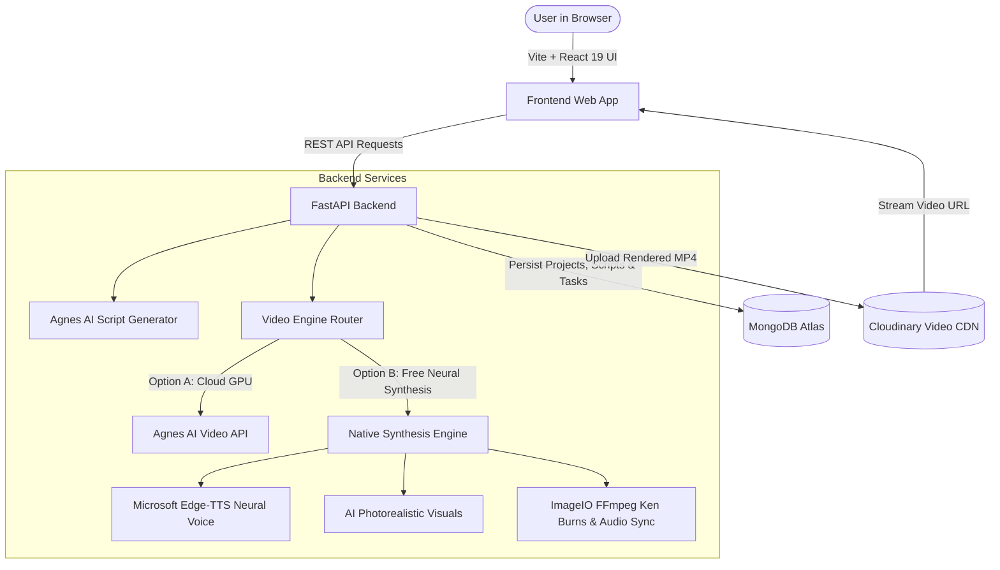

# 🎬 Qreate — Professional AI Video Generation Platform

<p align="center">
  <b>Turn ideas and prompts into production-ready, narrated multi-scene videos in seconds.</b>
</p>

<p align="center">
  
  
  
  
</p>

---

## ✨ Overview

**Qreate** is an end-to-end full-stack platform built for hackathons, creators, and teams to streamline the video creation lifecycle:
1. **Prompt to Script**: Generates structured, multi-scene video scripts with scene-by-scene narration and visual cues.
2. **Script Studio**: Interactive script editor to tweak narration, scene durations, and visual descriptions with live versioning and regeneration.
3. **Dual-Engine Video Generation**:
   - ⚡ **Native Free AI Multi-Scene Engine**: High-fidelity neural voiceover (Edge-TTS) + photorealistic scene visuals + cinematic Ken Burns camera motion + synchronized subtitles.
   - 🤖 **Agnes AI Video Generator**: Direct cloud GPU video generation via Agnes API Hub (`agnes-video-2.5-flash`).
   - 🔄 **Smart Auto-Fallback**: Automatically falls back to the Free Engine if third-party GPU queues are busy or rate-limited.
4. **Cloud Distribution**: Finished videos are permanently stored and streamed via Cloudinary CDN with interactive video playback and one-click MP4 download.

---

## 🏛️ System Architecture



---

## 🚀 Key Features

* **AI Script Generation**: Turn any topic into a production script with tone selection (professional, energetic, friendly, calm, dramatic) and audience targeting.
* **Interactive Script Editor**: Modify scene narration, adjust timing, add or delete scenes, and regenerate scenes dynamically.
* **Photorealistic Scene Visuals**: Generates authentic visuals for every scene with automatic photographic fallbacks.
* **Cinematic Camera Movement**: Features dynamic camera push-ins, pans, and zoom-outs using FFmpeg.
* **Synchronized Narration & Captions**: Natural neural audio narration with synchronized glassmorphic subtitles.
* **Project & Media Management**: Complete organization of projects, scripts, tasks, and generated videos with status tracking.
* **Interactive Video Player**: Cloudinary-powered streaming player with scrubber, replay, fullscreen, and direct MP4 downloads.

---

## 🛠️ Tech Stack

### Frontend
- **Framework**: React 19 with TypeScript
- **Bundler**: Vite
- **Styling**: TailwindCSS & Custom Design Tokens
- **Icons**: Lucide React
- **Routing**: React Router DOM v7
- **HTTP Client**: Axios

### Backend
- **Framework**: FastAPI (Python 3.9+)
- **Server**: Uvicorn (ASGI)
- **Database Driver**: Motor (Async MongoDB driver) + PyMongo
- **Video & Audio Synthesis**:
  - `edge-tts` (Microsoft Neural Voiceover)
  - `imageio-ffmpeg` (Bundled native FFmpeg binary)
  - `Pillow` (Caption rendering and image processing)
- **Cloud Storage**: Cloudinary Python SDK
- **Validation**: Pydantic v2 + Pydantic Settings

---

## 📁 Repository Structure

```
Qreate/
├── frontend/                     # React + Vite TypeScript frontend
│   ├── src/
│   │   ├── components/ui/        # Reusable design system (Buttons, Cards, Badges, Inputs)
│   │   ├── layouts/              # AppLayout (Sidebar, TopBar)
│   │   ├── pages/                # Landing, Dashboard, CreateVideo, ScriptEditor, GenerateVideo, Projects, VideoLibrary
│   │   ├── services/             # Axios API client
│   │   └── types/                # Domain TypeScript interfaces
│   ├── index.html
│   ├── package.json
│   ├── tailwind.config.js
│   └── vite.config.ts
│
├── backend/                      # FastAPI Python backend
│   ├── app/
│   │   ├── api/routes/           # API routes (health, projects, scripts, videos)
│   │   ├── core/                 # Config (settings from .env), Errors & Exception handlers
│   │   ├── database/             # MongoDB connection, indexing & CRUD layer
│   │   ├── schemas/              # Pydantic request/response models
│   │   └── services/
│   │       ├── agnes/            # Agnes AI Chat & Video API client
│   │       ├── cloudinary/       # Cloudinary video uploader
│   │       ├── script/           # Script generation & prompt builder
│   │       └── video_engine/     # Native Free Video Synthesis Engine
│   ├── requirements.txt          # Python dependencies
│   ├── .env.example              # Example environment configuration
│   └── .env                      # Local environment secrets (ignored by git)
│
├── .gitignore                    # Comprehensive secrets & artifact protection
└── README.md                     # Documentation
```

---

## 🏁 Quick Start Guide

### Prerequisites
- **Node.js**: v18+ and `npm`
- **Python**: v3.9+
- **MongoDB Atlas**: Free cluster connection string
- **Cloudinary**: Free cloud credentials

---

### 1. Clone the Repository
```bash
git clone https://github.com/Rishabh-verma-2/Qreate.git
cd Qreate
```

---

### 2. Backend Setup
```bash
cd backend

# Create and activate a virtual environment
python3 -m venv venv
source venv/bin/activate    # On Windows: venv\Scripts\activate

# Install dependencies
pip install -r requirements.txt

# Configure environment
cp .env.example .env
```

Open `backend/.env` and add your credentials:
```dotenv
# MongoDB Atlas
MONGODB_URI=mongodb+srv://<username>:<password>@cluster0.mongodb.net/?retryWrites=true&w=majority
MONGODB_DATABASE=qreate

# Cloudinary
CLOUDINARY_CLOUD_NAME=your_cloud_name
CLOUDINARY_API_KEY=your_api_key
CLOUDINARY_API_SECRET=your_api_secret

# Agnes AI (Optional / For Agnes Video GPU)
AGNES_API_KEY=your_agnes_api_key
AGNES_BASE_URL=https://apihub.agnes-ai.com
```

Start the backend server:
```bash
uvicorn app.main:app --reload --port 8000
```
- API Base URL: `http://localhost:8000`
- Interactive Swagger Docs: `http://localhost:8000/docs`

---

### 3. Frontend Setup
In a second terminal:
```bash
cd frontend

# Install npm packages
npm install

# Start development server
npm run dev
```
- Application Web UI: `http://localhost:5173`

---

## 📡 API Reference

| Method | Endpoint | Description |
|---|---|---|
| `GET` | `/api/health` | Health check for DB, Cloudinary & AI services |
| `POST` | `/api/projects` | Create a new project |
| `GET` | `/api/projects` | List all projects with script and video counts |
| `GET` | `/api/projects/{id}` | Get project details, scripts, and videos |
| `DELETE` | `/api/projects/{id}` | Delete a project and associated media |
| `POST` | `/api/scripts/generate` | Generate an AI script for a project |
| `GET` | `/api/scripts/{id}` | Retrieve script details and scene list |
| `PUT` | `/api/scripts/{id}` | Save modifications to script scenes |
| `POST` | `/api/scripts/{id}/regenerate` | Regenerate script scenes with new parameters |
| `POST` | `/api/videos/generate` | Start video generation (Free Engine, Agnes, or Auto) |
| `GET` | `/api/videos/tasks/{id}` | Poll generation task progress and status |
| `GET` | `/api/videos` | List all completed videos |
| `GET` | `/api/videos/{id}` | Get video metadata and streaming URL |

---

## 🛡️ Security & Environment Safety

- All API keys, database credentials, and secrets are strictly stored in `.env`.
- `.env`, `.env.*`, and virtual environment directories are protected via `.gitignore` to prevent secret leakage.
- Pre-flight CORS middleware is configured to accept frontend requests securely.

---

## 📄 License
This project is licensed under the MIT License.
