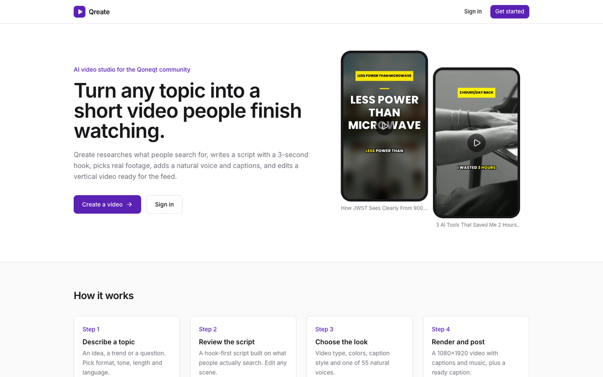
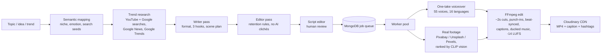
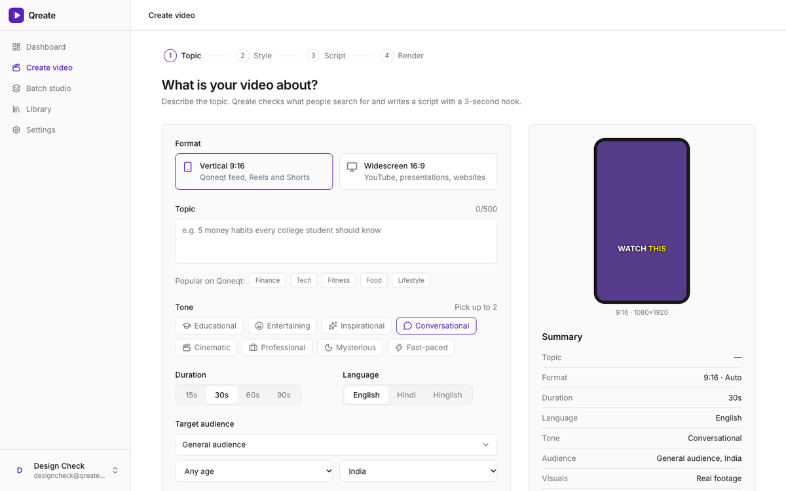
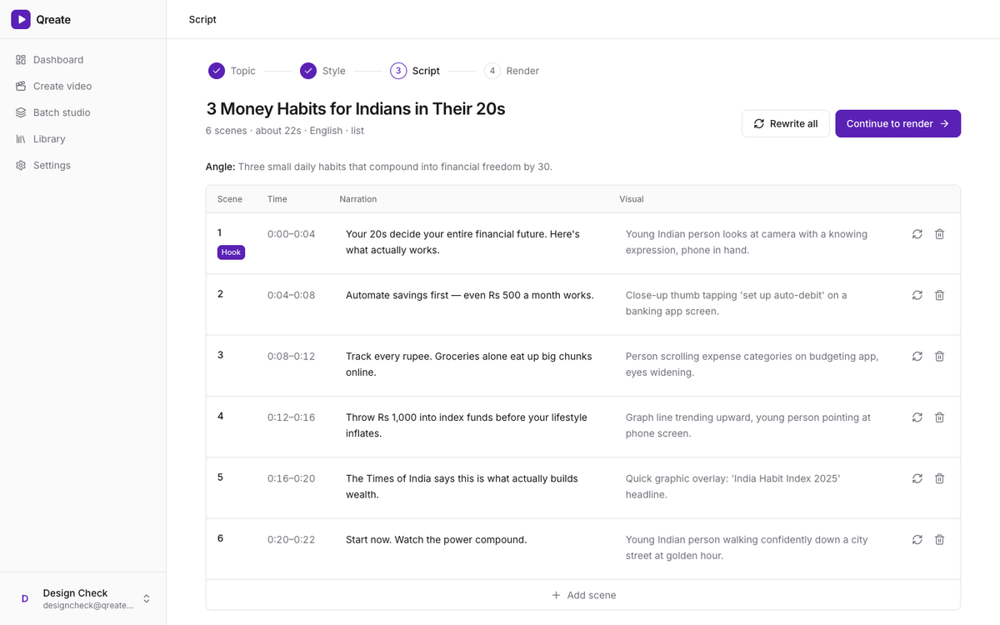
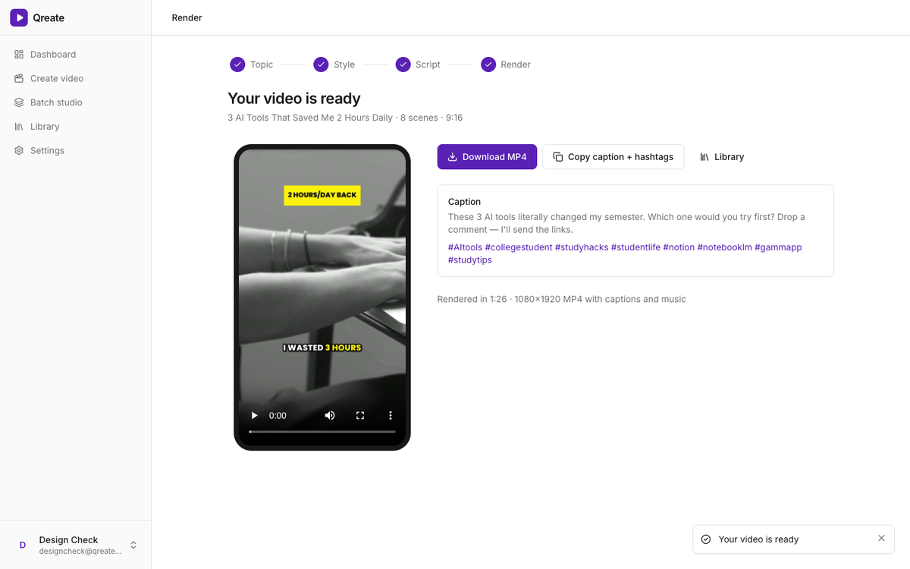

# Qreate — AI video studio for Qoneqt

Turn a topic, idea or trend into a publish-ready vertical video for the Qoneqt Global Feed:
trend research → hook-first script → real footage → natural voice → word-by-word captions → edited 1080×1920 MP4 with a ready-to-post caption.

**Team NeoQuant · CTRL FREAK 2026 (Qoneqt AI Challenge)**

| | |
|---|---|
| Live app | _add deployed frontend URL_ |
| API | _add deployed backend URL_ (`/api/health` shows live status) |
| Demo video | _add 3–4 min demo link_ |



---

## How it works



1. **Research before writing.** The idea is mapped to search phrases; real signals (what people search on YouTube and Google, recent news, today's trends in India) go into the prompt, so scripts use real facts instead of invented numbers.
2. **Hook in the first 3 seconds.** A writer pass picks a format (story, list, explainer, UGC, POV…), drafts three hooks and keeps the strongest; an editor pass tightens it.
3. **Human in the loop.** The creator reviews the script as a scene table and can rewrite any single scene.
4. **Looks like a real reel.** Real stock footage chosen by an AI that *looks* at each clip (CLIP), ~2-second shots, jump cuts and punch-ins, cuts on the music beat, whooshes on scene changes, captions that follow the voice.

| Create | Script | Result |
|---|---|---|
|  |  |  |

## Features

- **Formats:** auto, UGC, storytelling, explainer, listicle, cinematic, news recap, motivational, POV
- **Visual style:** realistic footage, animated, or mixed; option to prefer shots with people
- **Your own media:** upload photos/clips for personal stories (weddings, trips, launches)
- **Look:** 7 color themes + custom accent, 3 caption styles, pace, music mood
- **Voices:** 55 neural voices in 16 languages — English, Hindi, Hinglish, Marathi, Tamil, Telugu, Bengali, Gujarati, Kannada, Malayalam, Urdu, Spanish, French, German, Portuguese, Arabic — with previews
- **Batch studio:** many topics → many videos, rendered in parallel
- **Three engines:** Qreate reel engine (9:16), motion-graphics engine and classic engine (any aspect ratio)
- **Publish-ready:** MP4 download plus generated caption and hashtags

## Built to scale

- **Job queue in MongoDB** with leases: workers claim jobs atomically; a crashed worker's job is picked up again. Run more `python -m app.worker` processes on any machine to scale out.
- **Non-blocking rendering:** FFmpeg runs as async subprocesses; the API stays responsive.
- **Back-pressure and limits:** queue depth cap (HTTP 429), per-user hourly limits for scripts and videos, 500-character topics.
- **Resilience:** LLM provider chain (Groq → OpenRouter → Gemini → Agnes → Ollama) with retries; footage and music fall back gracefully; a render page resumes after refresh.
- **Health:** `/api/health` reports database, storage, script AI and footage sources.

## Tech stack

Frontend: React 19, TypeScript, Vite, Tailwind CSS, Lucide icons.
Backend: FastAPI, MongoDB (Motor), FFmpeg (libass), Edge TTS, open_clip (CLIP ViT-B-32), Cloudinary.
Free media sources: Pixabay, Unsplash, Openverse (CC0 music from Freesound), bundled OFL fonts.

## Run locally

```bash
# Backend
cd backend
python -m venv venv && source venv/bin/activate
pip install -r requirements.txt
pip install torch --index-url https://download.pytorch.org/whl/cpu && pip install -r requirements-ml.txt  # optional: CLIP
cp .env.example .env      # fill MONGODB_URI, CLOUDINARY_*, one LLM key, PIXABAY_API_KEY
uvicorn app.main:app --reload --port 8000

# Frontend (second terminal)
cd frontend
npm install
npm run dev               # http://localhost:5173
```

Sharing one MongoDB between teammates? Give each machine its own `JOB_QUEUE` (e.g. `qreate-yourname`) so local workers don't pick up each other's jobs.

## Deploy

- **Backend:** Docker (`backend/Dockerfile`, includes FFmpeg and fonts). `render.yaml` is a Render blueprint; Hugging Face Spaces (Docker, free 2 vCPU/16 GB) is a stronger free option for rendering. Production needs `ENVIRONMENT=production` and a private `JWT_SECRET_KEY` (32+ chars); the API refuses to start without it.
- **Frontend:** Vercel, root `frontend`, env `VITE_API_BASE_URL=<backend URL>` (`vercel.json` has SPA rewrites). Set `FRONTEND_URL` on the backend to the Vercel URL — in production only that origin may call the API.

## API

| Method | Endpoint | Purpose |
|---|---|---|
| GET | `/api/health` | Live status of DB, storage, AI, footage |
| POST | `/api/auth/register`, `/api/auth/login` | Accounts (JWT) |
| POST | `/api/scripts/generate` | Research + write a script |
| POST | `/api/scripts/{id}/scenes/{i}/regenerate` | Rewrite one scene |
| POST | `/api/videos/generate` | Render a script (`engine`: qreate, purffle, free) |
| GET | `/api/videos/tasks/{id}` · `/api/videos/tasks?active=true` | Render progress |
| POST | `/api/pipeline/run` | Topic → finished video in one call |
| POST/GET | `/api/batches` | Many topics → many videos |
| GET | `/api/voices`, `/api/voices/preview` | Voice catalog and previews |
| POST | `/api/uploads` | Creator photos/clips |
| GET | `/api/videos` | Library |

## Security

- `.env` files are git-ignored; only `.env.example` placeholders are committed.
- An early commit in this repository's history contained real credentials. Those keys must be rotated; rewriting history does not remove copies that may already exist.
- In production the API requires a private JWT secret and restricts CORS to the deployed frontend.

## Team

NeoQuant — CTRL FREAK 2026.
