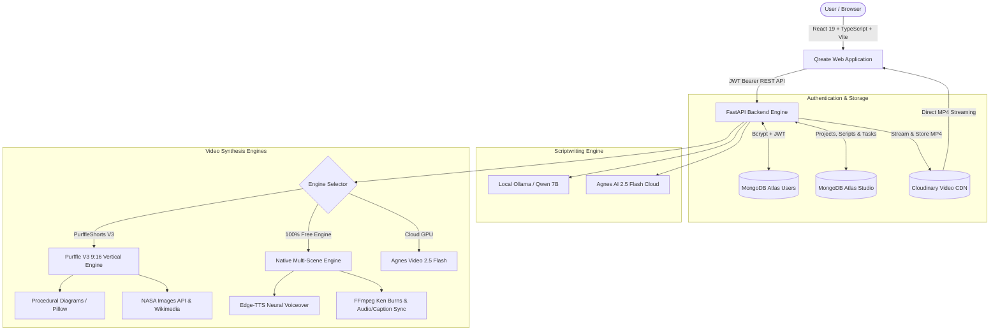

# 🎬 Qreate — Full-Stack AI Video Generation Platform

<p align="center">
  <b>Turn ideas and prompts into high-impact, narrated, multi-scene videos in seconds.</b>
  <br />
  Featuring PurffleShorts V3 procedural motion graphics, NASA space imagery, neural voiceover, and word-synchronized captions.
</p>

<p align="center">
  
  
  
  
  
</p>

---

## ✨ Overview

**Qreate** is an end-to-end full-stack studio platform designed for content creators, educators, and teams to effortlessly produce high-quality short-form and widescreen videos:

1. **AI Script Generation**: Turn any topic into structured multi-scene scripts with camera directions, visual descriptions, and narration cues. Supports multi-tone selection (*Educational, Cinematic, Entertaining, Professional, Inspirational, Fast-Paced*).
2. **Interactive Script Studio**: Live editor to refine narration, adjust scene pacing, add/remove scenes, and regenerate scenes dynamically.
3. **Multi-Engine Video Synthesis**:
   - 🎬 **PurffleShorts V3 Engine**: 1080×1920 (9:16 portrait) short-form generator featuring procedural motion graphics diagrams (Pillow + FFmpeg), authentic NASA / Wikimedia space imagery, and bold kinetic subtitles.
   - ⚡ **100% Free AI Engine**: High-fidelity Microsoft Edge-TTS neural speech + photorealistic scene visuals + cinematic Ken Burns camera motion + millisecond-synchronized captions.
   - 🤖 **Agnes AI Video Engine**: Cloud GPU video rendering (`agnes-video-2.5-flash`).
   - 🔄 **Smart Auto-Fallback**: Automatically falls back to local synthesis engines if remote GPU queues are busy or rate-limited.
4. **Studio Experience & Authentication**:
   - 🔐 **MongoDB Atlas Authentication**: User registration and login with salted Bcrypt password hashing, JWT bearer tokens, and `ProtectedRoute` routing guards.
   - 🌓 **Universal Light & Dark Mode**: Persistent theme toggle across the entire application with tailored color palettes.
   - 📊 **Studio Dashboard & Profile**: Personalized workspace greeting, KPI metrics (rendered watch-time, active projects), quick-prompt launcher, and dedicated `/profile` settings.
5. **Cloud Video Delivery**:
   - Permanent video hosting and streaming via Cloudinary CDN.
   - Cross-origin streaming download proxy (`/api/videos/download`) ensuring reliable 1-click MP4 downloads.

---

## 🏛️ System Architecture



---

## 🚀 Key Features

* **9:16 Vertical Shorts & 16:9 Widescreen**: Upfront format selector optimized for TikTok, Instagram Reels, YouTube Shorts, or widescreen YouTube longform.
* **Procedural Motion Graphics**: Over 2,400 lines of procedural scientific diagrams, charts, and visualizations across 7 archetypes (`HERO_VISUAL`, `SPLIT_AWARE`, `DUAL_ZONE`, `TEXT_HEAVY`).
* **NASA Images API Integration**: Automatically sources high-resolution imagery for space, astrophysics, and science topics.
* **Auto-Synced Video Duration**: Exact video duration is automatically calculated from approved scene scripts — eliminating redundant duration prompts.
* **Multi-Tone Scriptwriting**: Blend multiple tones simultaneously (e.g. *Educational + Cinematic + Dramatic*).
* **Word-by-Word Synchronized Captions**: Subtitles rendered with exact audio alignment.
* **Secure Studio Authentication**: Complete session management with automatic redirect to the landing page on sign out.
* **One-Click Video Downloads**: In-browser blob downloads backed by a server-side streaming proxy.

---

## 🛠️ Tech Stack

### Frontend
- **Framework**: React 19 with TypeScript
- **Build Tool**: Vite
- **Styling**: Vanilla CSS & TailwindCSS (Custom Light/Dark Tokens)
- **Icons**: Lucide React
- **Routing**: React Router DOM v7
- **HTTP Client**: Axios with Bearer Interceptors

### Backend
- **Framework**: FastAPI (Python 3.9+)
- **Server**: Uvicorn (ASGI)
- **Database**: Motor (Async MongoDB) + PyMongo
- **Authentication**: Passlib (Bcrypt) + PyJWT
- **Video & Graphics**:
  - `edge-tts` (Microsoft Neural Voiceover)
  - `imageio-ffmpeg` (Native FFmpeg Engine)
  - `Pillow` (Procedural 1080×1920 diagram graphics & frame rendering)
- **Cloud Delivery**: Cloudinary Python SDK
- **Validation**: Pydantic v2 + Pydantic Settings

---

## 📁 Repository Structure

```
Qreate/
├── frontend/                     # React 19 + TypeScript + Vite frontend
│   ├── src/
│   │   ├── components/           # UI components (Button, Card, Input, Badge, AuthModal, ProtectedRoute)
│   │   ├── context/              # AuthContext (JWT) & ThemeContext (Light/Dark)
│   │   ├── layouts/              # AppLayout (Sidebar, TopBar, Studio Workspace)
│   │   ├── lib/                  # Utilities (downloadVideoFile, utils)
│   │   ├── pages/                # Landing, Dashboard, Profile, CreateVideo, ScriptEditor, GenerateVideo, Projects, VideoLibrary
│   │   ├── services/             # Axios API client (authApi, projectsApi, scriptsApi, videosApi)
│   │   └── types/                # TypeScript interfaces (User, Script, Scene, VideoTask)
│   ├── index.html
│   ├── package.json
│   ├── tailwind.config.js
│   └── vite.config.ts
│
├── backend/                      # FastAPI Python backend
│   ├── app/
│   │   ├── api/routes/           # API routes (auth, health, projects, scripts, videos)
│   │   ├── core/                 # Config (.env settings), security (Bcrypt/JWT), errors
│   │   ├── database/             # MongoDB connection, indexing & CRUD
│   │   ├── schemas/              # Pydantic request & response models
│   │   └── services/
│   │       ├── agnes/            # Agnes AI chat & video client
│   │       ├── cloudinary/       # Cloudinary video uploader & deleter
│   │       ├── purffle/          # PurffleShorts V3 motion graphics & visual sourcer
│   │       ├── script/           # Script generator (Ollama local + Agnes cloud)
│   │       └── video_engine/     # Native free multi-scene synthesis engine
│   ├── requirements.txt          # Python dependencies
│   ├── .env.example              # Environment template
│   └── .env                      # Local environment secrets (ignored by git)
│
├── .gitignore                    # Comprehensive secrets & artifact protection
└── README.md                     # Platform documentation
```

---

## 🏁 Quick Start Guide

### Prerequisites
- **Node.js**: v18+ and `npm`
- **Python**: v3.9+
- **MongoDB Atlas**: Free cluster connection string ([MongoDB Cloud](https://cloud.mongodb.com))
- **Cloudinary**: Free cloud credentials ([Cloudinary Console](https://cloudinary.com))

---

### 1. Clone the Repository
```bash
git clone https://github.com/Rishabh-verma-2/Qreate.git
cd Qreate
```

---

### 2. Backend Setup
```bash
cd backend

# Create and activate Python virtual environment
python3 -m venv venv
source venv/bin/activate       # On Windows: venv\Scripts\activate

# Install dependencies
pip install -r requirements.txt

# Configure environment variables
cp .env.example .env
```

Edit `backend/.env` with your credentials:
```dotenv
# MongoDB Atlas
MONGODB_URI=mongodb+srv://<username>:<password>@cluster0.mongodb.net/?retryWrites=true&w=majority
MONGODB_DATABASE=qreate

# Cloudinary CDN
CLOUDINARY_CLOUD_NAME=your_cloud_name
CLOUDINARY_API_KEY=your_api_key
CLOUDINARY_API_SECRET=your_api_secret

# Agnes AI (Optional / For Agnes Video GPU)
AGNES_API_KEY=your_agnes_api_key
AGNES_BASE_URL=https://apihub.agnes-ai.com

# CORS Configuration
FRONTEND_URL=http://localhost:5173
```

Start the backend server:
```bash
uvicorn app.main:app --reload --port 8000
```
- API Base URL: `http://localhost:8000`
- Interactive Swagger Docs: `http://localhost:8000/docs`
- Health Check: `http://localhost:8000/api/health`

---

### 3. Frontend Setup
In a second terminal:
```bash
cd frontend

# Install npm packages
npm install

# Start development server
npm run dev
```
- Web Application: `http://localhost:5173`

---

## 📡 API Reference

| Method | Endpoint | Description |
|---|---|---|
| `GET` | `/api/health` | Health status for DB, Cloudinary & AI services |
| `POST` | `/api/auth/register` | Register a new user with salted Bcrypt password |
| `POST` | `/api/auth/login` | Authenticate user & issue JWT bearer token |
| `GET` | `/api/auth/me` | Retrieve profile of authenticated user |
| `POST` | `/api/auth/logout` | Invalidate current user session |
| `POST` | `/api/projects` | Create a new video project |
| `GET` | `/api/projects` | List all projects with script and video counts |
| `GET` | `/api/projects/{id}` | Get project details, scripts, and video artifacts |
| `DELETE` | `/api/projects/{id}` | Delete a project and associated media |
| `POST` | `/api/scripts/generate` | Generate AI script with multi-tone storytelling |
| `GET` | `/api/scripts/{id}` | Retrieve script details and scene list |
| `PUT` | `/api/scripts/{id}` | Save modifications to script scenes |
| `POST` | `/api/scripts/{id}/regenerate` | Regenerate script scenes with updated parameters |
| `POST` | `/api/videos/generate` | Start video generation (Purffle V3, Free Engine, Agnes, Auto) |
| `GET` | `/api/videos/tasks/{id}` | Poll generation task progress and status |
| `GET` | `/api/videos` | List all completed videos |
| `GET` | `/api/videos/{id}` | Get video metadata and streaming URL |
| `GET` | `/api/videos/download` | Streaming proxy endpoint for cross-origin MP4 downloads |

---

## 🛡️ Security & Git Hygiene

- All sensitive credentials, tokens, and database URIs are isolated in `backend/.env`.
- `.env`, `*.env`, media artifacts (`*.mp4`, `*.wav`), Python caches (`__pycache__`), and `node_modules` are excluded via `.gitignore`.
- Password hashing is enforced with Bcrypt (minimum 12 rounds).
- CORS middleware permits both `http://localhost:5173` and `http://127.0.0.1:5173` across all developer ports.

---

## 📄 License
This project is licensed under the MIT License.
